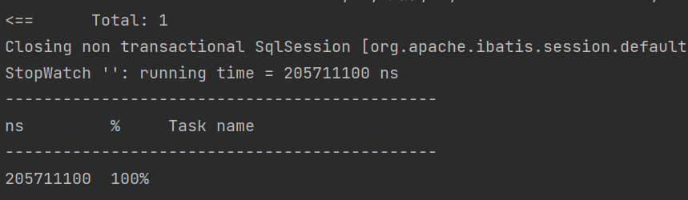
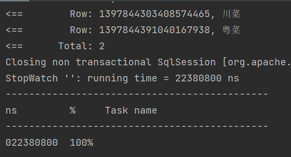

1. 查菜品对应种类名优化
原代码中我们对菜单中每个菜品,都拿它的categoryId去数据库中查一次categoryName.  
多次查数据库,不仅仅增大数据库压力,而且性能不佳.  

>使用StopWatch记录运行时间  

调优思路:  
- 准备好当前菜单所有的categoryId的list,使用 in ;查出这些categoryId对应的所有种类,一次查询  
- 我们又发现并不需要种类的所有信息,只需要种类id和种类名即可
- 我们得到的是list,从list中找每个id对应的name挺慢,所有又可以想到向list转为map.key为id,value为name.  
    >这样只需要遍历一次list即可
  
效果:

近十倍的提速.可能你现在感觉不到什么,但当整个数据库中数据巨多,业务量巨大时,这种提速就很有必要.  

- 加缓存:
加缓存是一种很常见的优化手段.  

